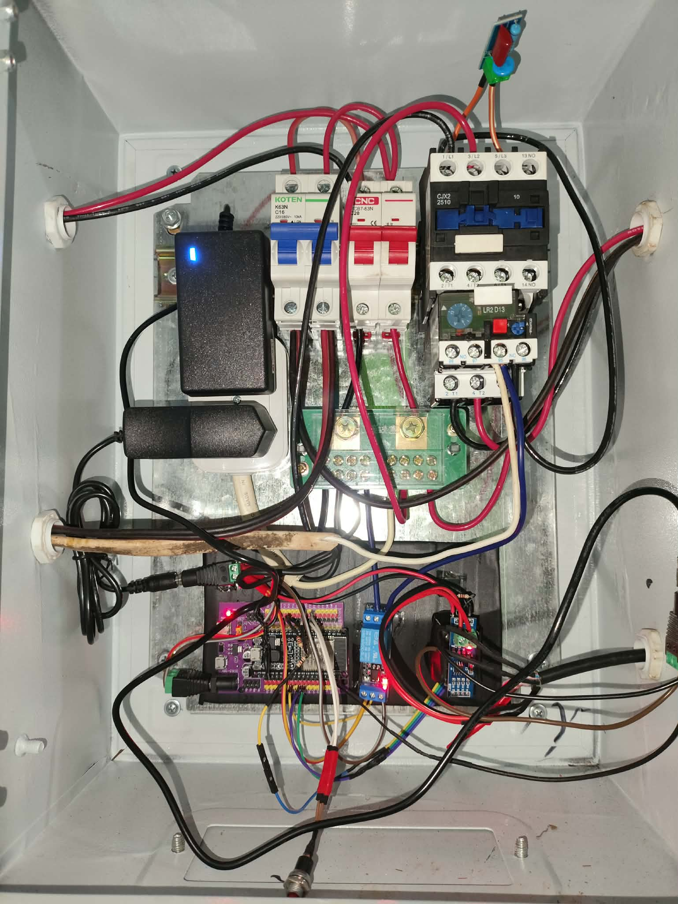
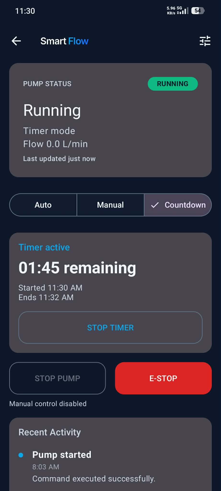
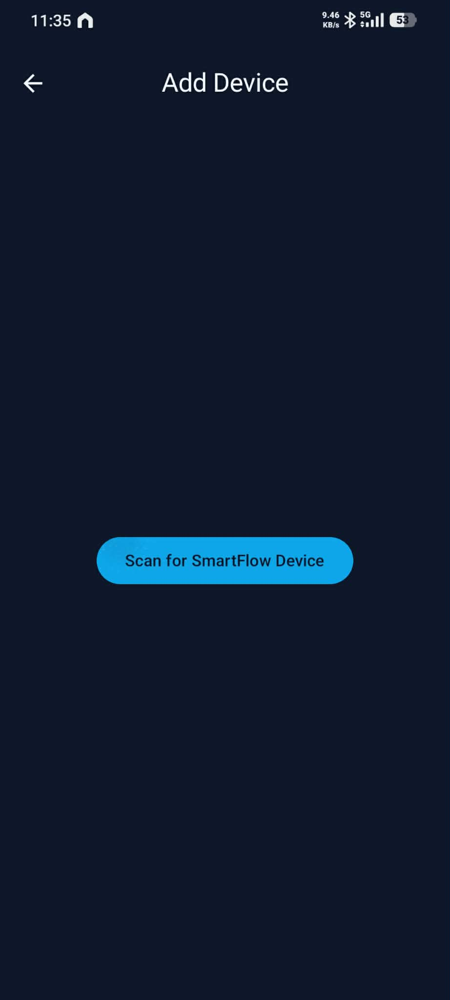

# SmartFlow

**A field-deployed IoT controller for a residential deep-well pump and water tank.**

[](LICENSE)
[](app/)
[](firmware/README.md)

SmartFlow is a personal project I designed, built, and installed to automate the water-pump system at my home in Iloilo, Philippines. It combines a two-node embedded system, a long-distance RS-485 sensor link, layered pump protection, Firebase services, and a native Android application.

The system is an operating **field-deployed prototype**, not a commercially certified controller. I developed the hardware integration, firmware, Android app, cloud backend, safety logic, documentation, testing, and installation as a single end-to-end project.

## The problem

Our 1.5 HP deep-well pump fills a 660 L storage tank. Operating it manually meant checking the water level, switching the pump at the right time, and noticing failures such as an empty water source, a bad sensor reading, or an unexpectedly long run.

I built SmartFlow to make that process observable and controllable while keeping shutdown decisions local. Cloud connectivity adds remote access, but the pump does not depend on the cloud to stop safely.

## Prototype in use

<table>
  <tr>
    <td width="46%" align="center">
      
      <br><sub>Field-installed prototype enclosure, shown open for component visibility.</sub>
    </td>
    <td width="27%" align="center">
      
      <br><sub>Countdown control with live state and an always-available emergency stop.</sub>
    </td>
    <td width="27%" align="center">
      
      <br><sub>Native Android provisioning flow for adding a nearby controller.</sub>
    </td>
  </tr>
</table>

> The enclosure photo documents a personal prototype installation. It is not evidence of electrical certification or a reference panel design. Work on mains-voltage equipment must be performed de-energized and in accordance with local requirements.

## What I built

- **ESP32 master controller** — runs the pump state machine, enforces local safety rules, drives the contactor relay, stores configuration, and synchronizes with Firebase.
- **ESP8266 tank node** — samples the waterproof ultrasonic level sensor and flow meter near the tank.
- **RS-485 field link** — carries framed telemetry over approximately 40 m of cable with sequence numbers, CRC16 validation, freshness checks, and stability gating.
- **Native Android app** — provides authentication, BLE provisioning, device ownership, real-time telemetry, AUTO/MANUAL/COUNTDOWN control, settings, notifications, diagnostics, and activity history.
- **Firebase backend** — uses Realtime Database, Authentication, Cloud Functions, Cloud Messaging, and Secret Manager-backed device bootstrap.
- **Pump-control hardware** — switches the motor through a magnetic contactor and independent thermal overload relay rather than driving the motor directly from a microcontroller relay.

## System architecture

```text
                    RESIDENTIAL INSTALLATION

  Tank                                                  Pump enclosure
  ┌────────────────────────┐       RS-485 / ~40 m       ┌─────────────────────────┐
  │ ESP8266 sensor node    │◄──────────────────────────►│ ESP32 master controller │
  │ • JSN-SR04T level      │   framed data + CRC16      │ • control state machine │
  │ • YF-G1 flow meter     │                            │ • local safety gates    │
  └────────────────────────┘                            └────────────┬────────────┘
                                                                    │ low-voltage relay
                                                        ┌───────────▼─────────────┐
                                                        │ Contactor + thermal     │
                                                        │ overload relay + pump   │
                                                        └─────────────────────────┘
                                                                    ▲
                                                                    │ telemetry/control
                                                        ┌───────────┴─────────────┐
                                                        │ Firebase RTDB + Auth +  │
                                                        │ Cloud Functions + FCM   │
                                                        └───────────┬─────────────┘
                                                                    │
                                                        ┌───────────▼─────────────┐
                                                        │ Native Android app      │
                                                        └─────────────────────────┘
```

The controller accepts cloud commands as operator intent, then applies local safety gates before changing the physical output. Loss of Wi-Fi or Firebase does not remove firmware and hardware shutdown protection.

## Engineering challenges

### Reliable sensing over distance

The water tank and pump controller are separated by a long cable run. I split the system into a tank-side sensor node and a master controller, then used half-duplex RS-485 instead of sending raw sensor signals across the property. The master rejects malformed, stale, out-of-range, or CRC-invalid frames and requires consecutive valid data before treating the link as stable.

### Failing toward pump OFF

Pump control is safety-sensitive: ambiguity should not turn or keep the motor on. The firmware blocks starts or stops a running pump when required sensor data becomes stale, and it maintains explicit lockouts for emergency stop, dry-run detection, and maximum runtime. A physical thermal overload relay remains independent of the software.

### Coordinating local hardware and cloud state

The Android app shows requested and reported state rather than assuming a button press succeeded. Controls wait for authoritative telemetry, and critical operations remain idempotent. Secure provisioning uses a nearby BLE exchange followed by a time-limited, backend-validated ownership claim instead of allowing clients to write ownership records directly.

### Operating without reflashing

Pump thresholds and calibration settings are stored remotely and persisted locally. The controller can continue using its last known configuration when disconnected, while diagnostics expose signal strength, memory, restart reason, sensor health, and communication status for troubleshooting.

## Safety model

SmartFlow uses several complementary protections:

| Layer | Responsibility |
|-------|----------------|
| Electrical protection | Circuit protection, magnetic contactor, protective earth, and an independent thermal overload relay |
| Firmware safeguards | Emergency-stop latch, dry-run lockout, maximum-runtime cutoff, minimum off-time, sensor validation, and communication freshness gating |
| Application controls | Explicit modes, confirmation feedback, disabled pending actions, warnings, and a continuously reachable emergency stop |

Manual or maintenance bypasses reduce software protection and are intended only for controlled diagnostics. See the [deployment safety checklist](DEPLOYMENT_SAFETY.md) and [canonical firmware rules](docs/specs/firmware_operational_rules.md) for the detailed constraints.

## Operating modes

- **AUTO** — starts and stops using configurable tank-level thresholds and hysteresis.
- **MANUAL** — accepts an operator's persistent on/off intent while retaining safety lockouts.
- **COUNTDOWN** — runs for an explicit duration and reports remaining time.

All modes remain subject to the emergency stop, dry-run protection, overflow runtime limit, cooldown, and valid-sensor requirements defined by the firmware.

## Technology

| Area | Technology |
|------|------------|
| Master firmware | ESP32, C++, Arduino framework, PlatformIO |
| Sensor firmware | ESP8266/NodeMCU, C++, Arduino framework, PlatformIO |
| Field communication | Half-duplex RS-485, 115200 8N1, CRC16-Modbus |
| Mobile application | Kotlin, Jetpack Compose, Material 3, Firebase Android SDK, BLE |
| Cloud | Firebase Realtime Database, Authentication, Cloud Functions, Cloud Messaging, Secret Manager |
| Backend runtime | Node.js 22, TypeScript, Firebase Functions v7 |
| Sensors | JSN-SR04T waterproof ultrasonic sensor, YF-G1 hall-effect flow meter |
| Motor control | Magnetic contactor and LR2-D13 thermal overload relay |

## Repository map

```text
smartflow/
├── app/                 # Native Android application
├── firmware/
│   ├── master_node/     # ESP32 controller
│   └── sensor_node/     # ESP8266 tank sensor
├── functions/           # Firebase Cloud Functions
├── hardware/            # Bill of materials and wiring references
├── docs/
│   ├── specs/           # Canonical current behavior
│   ├── operations/      # Deployment and troubleshooting runbooks
│   ├── adr/             # Architecture decisions
│   └── archive/         # Historical documentation
└── specs/               # Spec Kit feature artifacts
```

An earlier web-dashboard experiment was retired during development. The native Android app is the supported client represented in this portfolio repository.

## Build and validation

### Android app

Requirements: JDK 21, Android SDK, and an `app/google-services.json` for your Firebase project.

```powershell
./gradlew.bat test
./gradlew.bat assembleDebug
```

### Cloud Functions

```bash
cd functions
npm ci
npm run build
npm test
```

### Firmware

```bash
pio run -d firmware/master_node
pio run -d firmware/sensor_node
```

Firmware can be compiled without the installed pump, but flashing and end-to-end safety validation require the physical controllers and test setup. Never energize mains wiring solely to validate software setup.

## Documentation

- [Current system specifications](docs/specs/README.md)
- [Android application behavior](docs/specs/app.md)
- [Firmware architecture](docs/specs/firmware.md)
- [Firmware operational rules](docs/specs/firmware_operational_rules.md)
- [RS-485 protocol](docs/specs/rs485_protocol.md)
- [Bill of materials](hardware/bom.md)
- [Wiring notes](hardware/wiring_notes.md)
- [Contributing](CONTRIBUTING.md)
- [Security policy](SECURITY.md)

## Project status and limitations

SmartFlow is installed and operating at one residential site. Its field behavior is owner-observed, not independently certified or statistically validated across multiple installations. Current limitations include dependence on household Wi-Fi for remote access, hardware-specific calibration, and the need for physical equipment to validate the complete control chain.

Future work may include a cleaner revision of the prototype enclosure, expanded automated integration tests, and longer-term operational metrics.

## Author

Designed and developed by **Mark Alvin Cadangin** as a personal end-to-end IoT project.

## Copyright and permitted use

Copyright © 2026 Mark Alvin Cadangin. All rights reserved.

This repository is published for portfolio review and reference only. It is **not open source**, and no permission is granted to use, copy, modify, distribute, deploy, manufacture from, or create derivative works from the original SmartFlow materials without prior written permission. Public GitHub visibility still permits platform-level viewing and forking under GitHub's Terms of Service.

See the [proprietary notice](LICENSE) for details. Third-party libraries and materials remain subject to their respective licenses.
