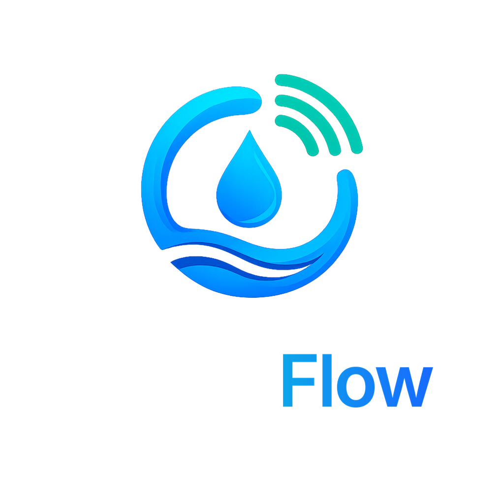

<div align="center">

<picture>
  <source media="(prefers-color-scheme: dark)" srcset="assets/smartflow-lockup-dark.png">
  <source media="(prefers-color-scheme: light)" srcset="assets/smartflow-lockup-light.png">
  
</picture>

### Residential IoT Deep-Well Pump & Water-Tank Automation System

**Hardware Controller · C++ Firmware (PlatformIO) · Native Android App (Kotlin & Jetpack Compose)**  
*Field-deployed operating prototype installed in Leon, Iloilo, Philippines*

[](firmware/)
[](firmware/)
[](app/)
[-4B5563?style=flat-square)](hardware/wiring_notes.md)
[](database.rules.json)
[](LICENSE)
[](https://markcadangin.me/projects/smartflow)

<br/>

<a href="#about-the-project">Overview</a> •
<a href="#how-it-works">Architecture</a> •
<a href="#three-layer-safety-architecture">Safety Engineering</a> •
<a href="#system-specifications--engineering-documentation">Specifications</a> •
<a href="#features">Features</a> •
<a href="#technical-specifications">Hardware Specs</a> •
<a href="#getting-started">Getting Started</a> •
<a href="#why-i-built-it-this-way">Design Rationale</a> •
<a href="https://markcadangin.me/projects/smartflow">Live Case Study</a>

</div>

---

## About the Project

In rural and suburban areas like Leon, Iloilo, residential water systems frequently rely on deep-well submersible or surface pumps to fill elevated storage tanks. During hot or dry months, the local water table drops, leading to pump cavitation and dry-running that can burn out an expensive motor within minutes if left unattended.

I built **SmartFlow** to solve this problem for my family's home setup: an automated two-node controller that manages a 1.5 HP deep-well pump filling a 660-liter overhead storage tank.

The system uses an ultrasonic sensor at the tank and a hall-effect flow sensor at the pipe to track water levels and flow rates in real time. If the pump turns on but water fails to flow within 15 seconds, firmware automatically cuts power and enters a dry-run lockout before the pump can overheat.

**Deployment status:** Field-installed operating prototype at 1 residential site in Leon, Iloilo. Monitored and maintained personally as an operating prototype, not a commercial product.

---

## How It Works

```
                     OVERHEAD TANK (660L)
                     ┌───────────────────────────────┐
                     │ JSN-SR04T Ultrasonic Sensor   │
                     │ YF-G1 Hall-Effect Flow Meter  │
                     └───────────────┬───────────────┘
                                     │
                     ESP8266 Tank Sensor Node
                                     │
                                     │  ~40m CAT6 UTP Cable
                                     │  RS-485 (MAX485, CRC16)
                                     │
                                     ▼
                     ESP32 Master Controller (IP65 Enclosure)
                      ├── Relay Module (Active HIGH / Fail-Safe)
                      ├── Firebase RTDB Sync (every 3s via Wi-Fi)
                      └── Bluetooth LE (Provisioning Service)
                                     │
                                     ▼
            HIGH-VOLTAGE POWER CHAIN (Independent Hardware Layer)
            Grid (220V AC) ──► 20A MCB ──► CJX2 Contactor ──► LR2-D13 TOR ──► 1.5 HP Motor
                                                │
                                    Physical Manual Bypass Switch
```

---

## Three-Layer Safety Architecture

A primary design requirement was that software should never be the single point of failure when switching inductive mains power:

1. **Hardware Layer (Always Active)**:
   - An **LR2-D13 thermal overload relay** sits directly between the contactor and the pump motor. If the motor pulls excessive current (> 8–9A FLA), the bimetallic strip trips mechanically, cutting circuit power regardless of microcontroller or cloud state.
   - A **20A miniature circuit breaker (MCB)** provides short-circuit and branch protection.
   - The relay module driving the contactor coil is wired **normally open** (fail-safe). If the ESP32 loses power or resets, the contactor coil de-energizes and the pump turns off.

2. **Firmware Safeguards (Local Autonomy)**:
   - **Dry-run lockout**: When the pump energizes, firmware monitors the flow meter. If flow stays below 0.5 L/min for 15 consecutive seconds, the pump shuts down immediately with a dry-run fault.
   - **Runtime ceiling**: Maximum continuous run timer (default 45 minutes) stops the pump to prevent overflow even if the level sensor fails.
   - **RS-485 link watchdog**: If the master loses communication with the tank sensor node for more than 5 consecutive polling cycles, the pump is held off.
   - **Local persistence**: Critical state and threshold parameters are persisted in non-volatile storage (NVS), so the system resumes safe operation immediately across power outages without waiting for Wi-Fi.

3. **Manual Override**:
   - A physical rotary bypass switch bypasses the relay module and powers the contactor coil directly. This allows emergency pumping or system testing even if both microcontrollers are offline.

---

## System Specifications & Engineering Documentation

SmartFlow follows strict architectural specifications and lifecycle tracking:

- **[Specification Index](docs/specs/README.md)**: Master architectural and domain specifications.
- **[Firmware Operational Rules](docs/specs/firmware_operational_rules.md)**: State machine transitions, failsafe logic, and sensor polling timeouts.
- **[Android Application Behavior](docs/specs/app.md)**: Reactive state synchronization, BLE ownership workflows, and UI requirements.
- **[RS-485 Framing Protocol](docs/specs/rs485_protocol.md)**: Half-duplex packet framing, CRC16 error detection, and register maps.
- **[Pre-Energization Verification](DEPLOYMENT_SAFETY.md)**: Hardware grounding, contactor insulation, and thermal overload calibration checklist.
- **[Security Policy](SECURITY.md)**: Vulnerability disclosure, threat model, and credentials rotation procedures.
- **[Contributing & Development Guide](CONTRIBUTING.md)**: Branching strategy (`main` / `develop`), local build & test validation commands.

---

## Features

- **Three Operating Modes**:
  - **AUTO**: Starts filling when the tank falls below the configurable start threshold (default 20%) and stops when it reaches the target level (default 90%).
  - **MANUAL**: Direct start and stop control from the Android application or physical enclosure pushbuttons.
  - **COUNTDOWN**: Runs the pump for a specified user duration with live second-by-second countdown in the app and firmware-side timer enforcement.
- **Native Android App (`app/`)**:
  - Built with Kotlin and Jetpack Compose (Material 3).
  - Bluetooth Low Energy (BLE) setup flow to provision home Wi-Fi credentials to the ESP32 without hardcoding passwords.
  - Live tank telemetry: percentage level, estimated volume in liters, flow rate in L/min, Wi-Fi RSSI, and controller state.
  - Runtime parameter tuning: adjust fill thresholds and safety timeouts directly from your phone.
- **Wired RS-485 Sensor Link**:
  - 40-meter outdoor CAT6 line connecting the master controller to the tank sensor node.
  - MAX485 transceivers with CRC16 frame validation to prevent noise interference from nearby pump motor lines.
- **Event Audit Log**:
  - Pump start/stop events, fault lockouts, and mode changes sync to Firebase Realtime Database for operational history.

---

## Technical Specifications

| Subsystem | Component / Technology | Details |
|---|---|---|
| **Master Node** | ESP32 DevKit V1 (38-pin) | PlatformIO, C++, FreeRTOS non-blocking loop |
| **Sensor Node** | NodeMCU V2 (ESP8266) | PlatformIO, C++, UART-to-RS485 sensor bridge |
| **Inter-Node Bus** | RS-485 via MAX485 Transceivers | Half-duplex, 9600 baud, CRC16 checksums, ~40m CAT6 UTP |
| **Mobile Client** | Android Application (`app/`) | Kotlin, Jetpack Compose, RxAndroidBle3, Coroutines |
| **Cloud Functions** | Node.js 22, TypeScript | FCM push notifications, device bootstrapping, authorization |
| **Cloud Backend** | Firebase Realtime Database | Real-time state sync, rules-based authorization |
| **Motor Contactor** | CJX2-2510 (220V AC coil) | Switches 220V mains to pump motor |
| **Thermal Protection**| LR2-D13 Thermal Overload Relay | Adjustable 7–10A range, set to 8–9A FLA |
| **Level Sensor** | JSN-SR04T-2.0 | Waterproof ultrasonic transducer (20–600 cm range) |
| **Flow Sensor** | YF-G1 | 1-inch hall-effect turbine meter (1–60 L/min) |
| **Enclosure** | IP65 ABS Weatherproof Box | 30 × 40 × 20 cm with PG cable glands |

---

## Repository Structure

```
smart-water-pump-controller/
├── app/                             # Native Android application (Kotlin, Jetpack Compose, Material 3)
│   ├── src/main/java/com/smartflow/ # UI screens, ViewModels, BLE client, Firebase repositories
│   ├── build.gradle.kts             # Android build configuration (compileSdk 34)
│   └── google-services.json.example # Firebase configuration template
├── firmware/                        # Microcontroller firmware (PlatformIO, C++)
│   ├── master_node/                 # ESP32 master controller (control loop, safety, RS-485, BLE, Firebase)
│   │   ├── src/                     # C++ source code & modular logging sinks
│   │   ├── smartflow_ota.csv        # Custom dual-partition table for OTA firmware flashing
│   │   └── platformio.ini           # ESP32 environment configuration & pinned libraries
│   ├── sensor_node/                 # ESP8266 tank sensor node project
│   │   ├── src/                     # Sensor sampling (ultrasonic & flow pulse counting)
│   │   └── platformio.ini           # ESP8266 environment configuration
│   └── README.md                    # Detailed firmware pinouts and calibration notes
├── functions/                       # Firebase Cloud Functions (Node.js 22, TypeScript)
│   ├── src/                         # FCM push triggers, device bootstrapping, RTDB security tests
│   └── package.json                 # Cloud backend dependencies & test runners
├── hardware/                        # Physical build documentation
│   ├── bom.md                       # Bill of materials and component ratings
│   ├── wiring_notes.md              # Wiring schematics and terminal references
│   └── enclosure_layout.md          # Internal DIN-rail and component arrangement
├── docs/                            # Specifications and operational runbooks
│   ├── specs/                       # Formal system specifications (app, firmware, RS-485 protocol)
│   ├── setup/environment-setup.md   # Developer credential and toolchain guide
│   └── operations/safety.md         # Commissioning and safety protocol
├── assets/                          # Official brand lockups, diagrams, and hardware photos
│   ├── smartflow-lockup-dark.png    # High-resolution dark theme brand lockup
│   ├── smartflow-lockup-light.png   # High-resolution light theme brand lockup
│   └── smartflow-brandmark.png      # Brand icon asset
├── database.rules.json              # Firebase Realtime Database security rules
└── DEPLOYMENT_SAFETY.md             # Pre-energization verification checklist
```

---

## Getting Started

### 1. Prerequisites

- [PlatformIO Core](https://platformio.org/) or PlatformIO IDE extension for VS Code.
- [Android Studio Ladybug (or newer)](https://developer.android.com/studio) with Android SDK 34.
- Java Development Kit (JDK 21 or 17).
- Node.js 22 for Cloud Functions.
- A Firebase project with **Realtime Database** and **Anonymous Authentication** enabled.

### 2. Microcontroller Firmware

1. Navigate to the master controller firmware:
   ```bash
   cd firmware/master_node
   ```
2. Copy the configuration template and configure your Firebase credentials:
   ```bash
   cp src/config/secrets.h.example src/config/secrets.h
   # Edit secrets.h with your Firebase Database URL and Web API Key
   ```
3. Connect the ESP32 DevKit via USB and flash:
   ```bash
   pio run -t upload
   ```
4. Flash the ESP8266 sensor node:
   ```bash
   cd ../sensor_node
   pio run -t upload
   ```
   > *Note:* On the NodeMCU V2, disconnect the MAX485 RX/TX pins while uploading via USB, then reconnect them for operation.

### 3. Android Application

1. Download your `google-services.json` from the Firebase Console (Android package: `com.smartflow`).
2. Place the file at `app/google-services.json`.
3. Open the project root in Android Studio or compile via command line:
   ```bash
   ./gradlew :app:assembleDebug
   ```
4. Install the debug APK on an Android device running Android 8.0 (API 26) or higher.

---

## Safety & Commissioning Checklist

Before energizing the 220V mains supply, complete the steps outlined in [DEPLOYMENT_SAFETY.md](DEPLOYMENT_SAFETY.md):

- [ ] Confirm no continuity between 220V Live and Neutral or chassis ground with a multimeter.
- [ ] Verify Thermal Overload Relay dial is set to match motor nameplate Full Load Amps (8–9A).
- [ ] Verify earth grounding from enclosure DIN rail to pump casing measures < 1Ω.
- [ ] Verify voltage divider outputs on sensor pins do not exceed 3.3V logic levels.
- [ ] Test relay module de-energization: verify contactor drops out when microcontroller power is cut.

---

## Why I Built It This Way

- **Why a separate tank node instead of running sensor wires to the pump?**  
  The elevated water tank is roughly 40 meters away from the pump house and electrical panel. Running raw analog or pulse signals over that distance introduces massive electromagnetic interference from power lines. Using an ESP8266 at the tank as a dedicated digitizer and sending framed, CRC16-validated RS-485 packets ensures rock-solid data integrity over long CAT6 runs.

- **Why hardware contactor + thermal overload relay instead of a simple relay module?**  
  A 1.5 HP motor has an inductive inrush current that will easily weld the contacts of cheap 5V hobby relay boards. SmartFlow uses an industrial CJX2-2510 contactor rated for motor duty, paired with an LR2-D13 thermal overload relay that mechanically trips if the motor draws excessive current.

- **Why an Android app instead of a web dashboard?**  
  While the project initially had a Next.js prototype dashboard, an Android app made far more sense for the actual user in the household: it connects via Bluetooth Low Energy to configure Wi-Fi credentials directly, receives push notifications, and is immediately accessible on mobile devices without relying on browser caching or web hosting.

---

## Author & Attribution

Developed by **[Mark Alvin Cadangin](https://markcadangin.me)**  
3rd-Year BSIT Student majoring in Software Development Technologies at West Visayas State University  
DOST-SEI Scholar (Batch 2024) · Leon, Iloilo, Philippines  
Portfolio: [markcadangin.me](https://markcadangin.me) · Email: [markcadangin@gmail.com](mailto:markcadangin@gmail.com)

---

## License

This project is licensed under the Apache License 2.0. See the [LICENSE](LICENSE) file for details.
